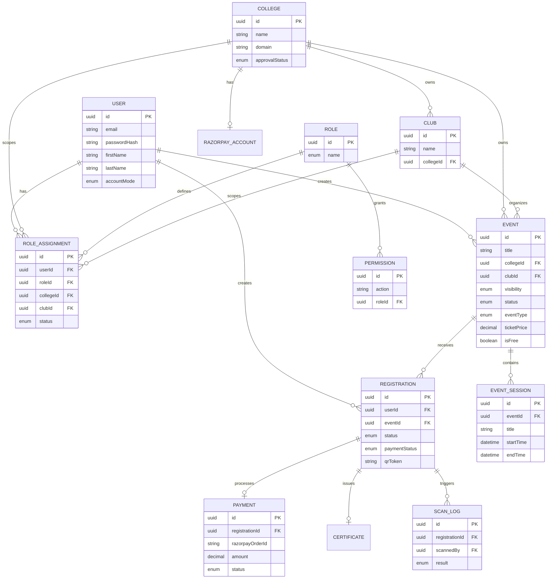

# Database Schema

Eventura uses a PostgreSQL database structured around three primary scoping boundaries: Global, Tenant-Scoped, and Transactional.

## Entity Relationship Diagram

## Schema Scopes Explained

### 1. Global Scope
Tables that operate at the platform level and do not require a tenant (`collegeId`) context to query.
- **User**: Authentication, personal details, system-wide preferences.
- **College**: The root tenant entity.
- **Role & Permission**: Definitions of RBAC constraints.
- **PlatformSettings**: Singleton table for global configurations like platform fee percentages.

### 2. Tenant Scope
Tables that must be queried through the lens of a specific College. The API enforces this via `AsyncLocalStorage` and Prisma query extensions.
- **Club**: Sub-organizations within a college.
- **RoleAssignment**: A user's specific role within a specific college (and optionally, club).
- **Event**: The core event template. 
- **EventSession**: Sub-sessions or scheduling blocks within an event.
- **SharedEvent**: A mechanism for Event A (created in College A) to be visible to College B.

### 3. Transactional Scope
Tables created organically through user interaction. 
- **Registration**: The pivot linking a User to an Event.
- **Payment**: The financial ledger entry for a registration.
- **ScanLog**: An audit of ticket check-ins.
- **Waitlist**: Users waiting for spots to open up.
- **Certificate**: PDF certificates generated post-event.
- **AuditLog**: Platform-wide mutations and actions.
