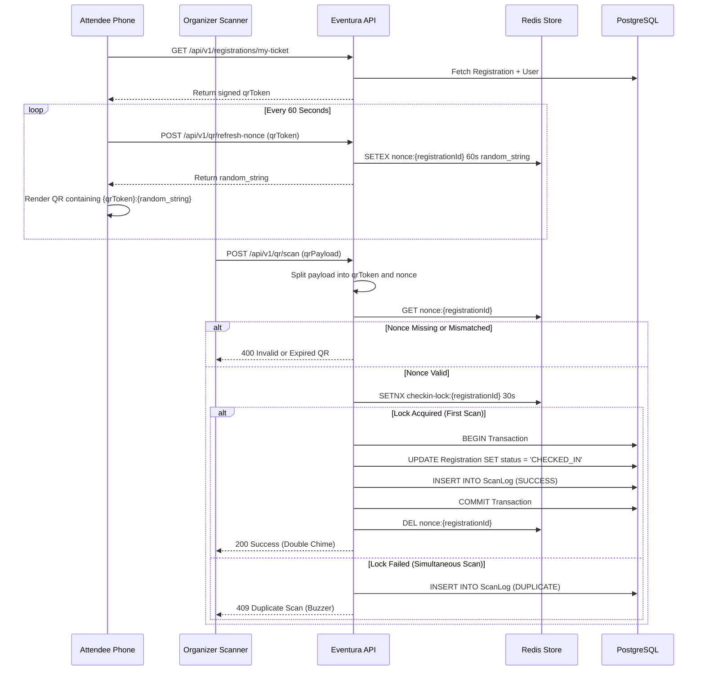

# QR Check-in Flow

Eventura implements a "Rotating Nonce" architecture to prevent ticket fraud. Static QR codes can be easily screenshotted and shared among friends. To combat this, the QR code on the student's phone must refresh continuously.

## The Mechanism

The architecture relies on a combination of PostgreSQL (for the static token) and Redis (for the fast, rotating nonces and idempotency locks).

## Security Guarantees
1. **Screenshot Protection**: Because the nonce expires every 60 seconds, a screenshot sent via WhatsApp will likely expire before the friend reaches the front of the line.
2. **Replay Protection**: The `SETNX` lock prevents race conditions if an organizer accidentally double-taps the scan button, or if two organizers scan the same phone simultaneously.
3. **Offline Fast-Fail**: If the token signature is completely invalid, the API rejects it before even hitting Redis or PostgreSQL.
