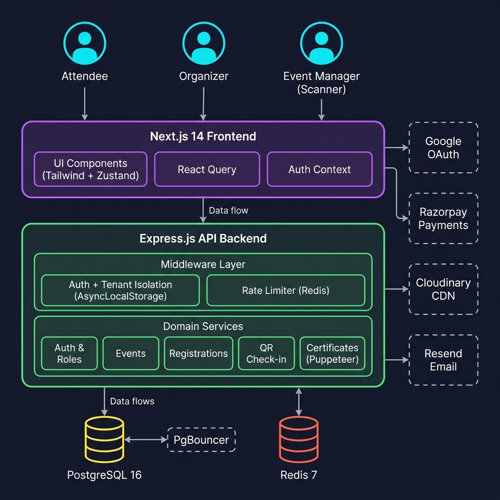
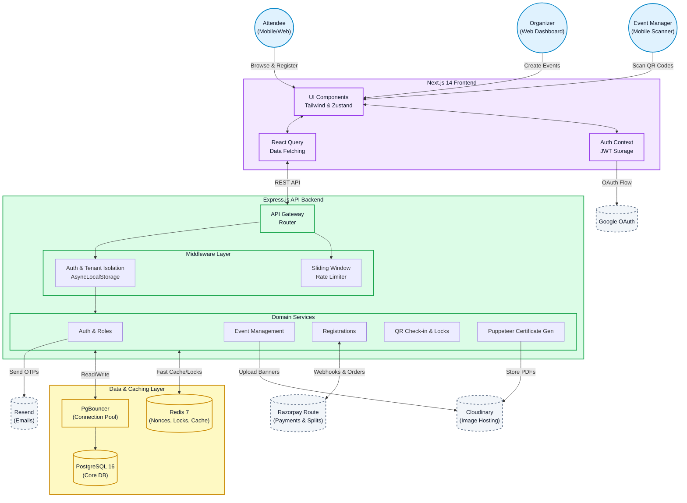

# Eventura System Overview

This diagram provides a crisp, end-to-end view of the Eventura architecture, detailing how the frontend, backend, databases, and external services interact.

```mermaid
flowchart TD
    %% Users / Clients
    Attendee(("Attendee\n(Mobile/Web)"))
    Organizer(("Organizer\n(Web Dashboard)"))
    Scanner(("Event Manager\n(Mobile Scanner)"))

    %% Frontend App
    subgraph Frontend ["Next.js 14 Frontend"]
        UI[UI Components\nTailwind & Zustand]
        ReactQuery[React Query\nData Fetching]
        AuthStore[Auth Context\nJWT Storage]
        
        UI <--> ReactQuery
        UI <--> AuthStore
    end

    %% External Providers
    GoogleOAuth[("Google OAuth")]
    Razorpay[("Razorpay Route\n(Payments & Splits)")]
    Cloudinary[("Cloudinary\n(Image Hosting)")]
    Resend[("Resend\n(Emails)")]

    %% Backend API
    subgraph Backend ["Express.js API Backend"]
        Gateway[API Gateway\nRouter]
        
        subgraph Middlewares ["Middleware Layer"]
            AuthMid[Auth & Tenant Isolation\nAsyncLocalStorage]
            RateLimit[Sliding Window\nRate Limiter]
        end
        
        subgraph Services ["Domain Services"]
            AuthSvc[Auth & Roles]
            EventSvc[Event Management]
            TicketingSvc[Registrations]
            ScanSvc[QR Check-in & Locks]
            PdfSvc[Puppeteer Certificate Gen]
        end
        
        Gateway --> AuthMid
        Gateway --> RateLimit
        AuthMid --> Services
    end

    %% Data Layer
    subgraph DataLayer ["Data & Caching Layer"]
        Redis[("Redis 7\n(Nonces, Locks, Cache)")]
        PgBouncer["PgBouncer\n(Connection Pool)"]
        Postgres[("PostgreSQL 16\n(Core DB)")]
        
        PgBouncer --> Postgres
    end

    %% Connections
    Attendee -->|Browse & Register| UI
    Organizer -->|Create Events| UI
    Scanner -->|Scan QR Codes| UI
    
    ReactQuery <-->|REST API| Gateway
    AuthStore -->|OAuth Flow| GoogleOAuth
    
    Services <-->|Read/Write| PgBouncer
    Services <-->|Fast Cache/Locks| Redis
    
    TicketingSvc <-->|Webhooks & Orders| Razorpay
    EventSvc -->|Upload Banners| Cloudinary
    AuthSvc -->|Send OTPs| Resend
    PdfSvc -->|Store PDFs| Cloudinary

    %% Styling
    classDef client fill:#e0f2fe,stroke:#0284c7,stroke-width:2px,color:#0f172a;
    classDef frontend fill:#f3e8ff,stroke:#9333ea,stroke-width:2px,color:#0f172a;
    classDef backend fill:#dcfce7,stroke:#16a34a,stroke-width:2px,color:#0f172a;
    classDef data fill:#fef9c3,stroke:#ca8a04,stroke-width:2px,color:#0f172a;
    classDef external fill:#f1f5f9,stroke:#64748b,stroke-width:2px,stroke-dasharray: 5 5,color:#0f172a;

    class Attendee,Organizer,Scanner client;
    class Frontend,UI,ReactQuery,AuthStore frontend;
    class Backend,Gateway,Middlewares,Services backend;
    class DataLayer,Redis,PgBouncer,Postgres data;
    class GoogleOAuth,Razorpay,Cloudinary,Resend external;
```
